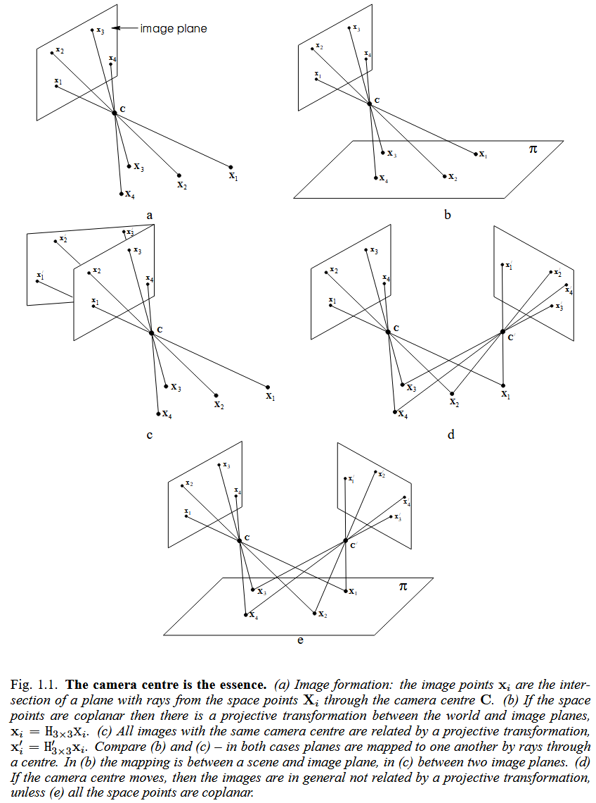
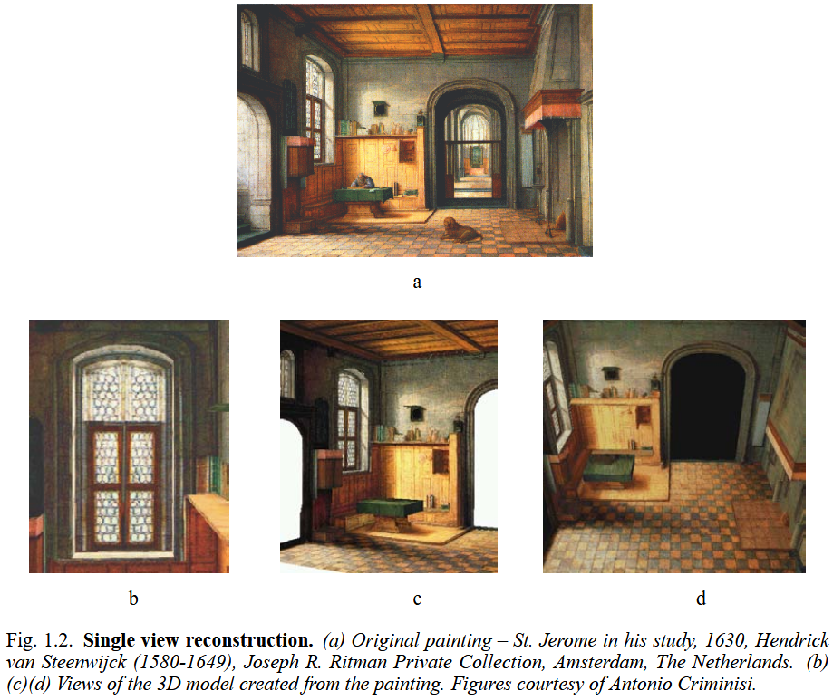
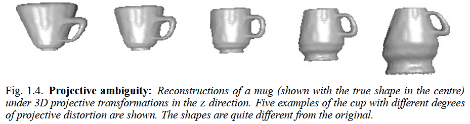

## 1.1 The ubiquitous projective geometry
**Coordinate.** The triple $(x,y,1)$, called homogeneous coordinate, represents the same point as the pair $(x,y)$. Futhermore, $(kx,ky,k)$ represents the same point as well, for any non-zero value $k$. For the triple $(x,y,0)$, if we divide the last coordinate, we get the infinite point $(x/0, y/0)$. Therefore, infinite points are represented by *homogeneous coordinates* in which the last coordinate is zero. Projective space  $\mathbb{P}^n$ is an extension of Euclidean space $\mathbb{R}^n$ by representing points as homogeneous vectors, where two lines (also with parallel) always meet in a point, containing those points at infinity, called “ideal points”. Points at infinity in the two-dimensional projective space form the *line at infinity*, and in three-dimensional space they form the *plane at infinity*.

**Homogeneity.** In Euclidean space, the whole of the space is homogeneous. We can pick any point as the origin and translate and rotate it to a different position, which is known as a Euclidean transform. We can also stretch linearly by different ratios in different directions, which is known as an *affine* transform. Both of the transforms, points at infinity remain at infinity. By analogy with Euclidean or affine transformations, we may define a *projective transformation* of projective space
$$
\mathbf{X}^{\prime}=\mathrm{H}_{\left( n+1 \right) \times \left( n+1 \right)}\mathbf{X}.
$$

A point is represented by homogeneous coordinate (an (n+1)-vector) and is multiplied by a non-singular matrix. Under such mapping, shapes, lengths, angles, distances, distance ratios are not preserved, except for straightness. What’s more, the points at infinity are not preserved neither. This go against the spirit of pure projective geometry, but makes it useful for practical problems. In other words, we treat all points in projective space as equals, but singling out the line and the plane at infinity in the 2D image and the 3D world when that becomes necessary.

**Affine geometry.** In projective space, there is no concept of infinite points - all points are equal. When we pick out some particular line, and decide that is the line at infinity, parallel comes up if two lines meeting at the infinite line. We can also define equalities of intervals between two points on parallel lines. The geometry of the projective plane with a distinguished line is known as *affine geometry*, and any projective transformation that maps the distinguished line in one space to the distinguished line of the other space is known as an *affine transformation*.

**Euclidean geometry.** A circle is not a concept of affine geometry, because arbitrary stretching of the plane turns the circle into an ellipse. In Euclidean however, they are distinct. Two ellipses will most generally intersect in four points. For two circles, they intersect in two real points and two other *complex* points, called *circular points*.

The equation for a circle in homogeneous coordinates $(x,y,w)$ is of the form
$$
\left( x-aw \right) ^2+\left( y-bw \right) ^2=r^2w^2.
$$

The center of the circle is $\left( x_0,y_0,w_0 \right) ^{\mathbf{T}}=\left( a,b,1 \right) ^{\mathbf{T}}$. The complex points $\left( x,y,w \right) ^{\mathbf{T}}=\left( 1,\pm i,0 \right) ^{\mathbf{T}}$ lie on every such circle, and therefore they lie in the intersection of any two circles. These two points lie on the line at infinity. *Euclidean geometry* arises from projective geometry by singling out first a line at infinity and subsequently, two points called circular points lying on this line.

**3D Euclidean geometry.** In homogeneous coordinates $\left( \mathrm{X},\mathrm{Y},\mathrm{Z},\mathrm{T} \right) ^{\mathbf{T}}$ all spheres intersect the plane at infinity in a curve with the equations: $\mathrm{X}^2+\mathrm{Y}^2+\mathrm{Z}^2=0;\mathrm{T}=0$. This a second-degree curve consisting only of complex points, which is known as *absolute conic*. In general 3D Euclidean geometry is derived from projective geometry by singling out the plane at infinity and specifying the absolute conic lying in this plane.

## 1.2 Camera projections
Camera projection is modeled by *central projection* in which a ray from a point in space will intersect a specific plane, called image plane, dropping from three-dimensional world $\mathbb{P} ^3$ to a two-dimensional image $\mathbb{P}^2$ in projective geometry. Let the center of projection be the origin $\left( 0,0,0,1 \right) ^{\mathbf{T}}$. All points $\left( \mathrm{X},\mathrm{Y},\mathrm{Z},\mathrm{T} \right) ^{\mathbf{T}}$ for fixed $\mathrm{X},\mathrm{Y},\mathrm{Z}$, but varying $\mathrm{T}$ form a single ray passing through the center and projecting to the same point at the image. The linear mapping is represented by a $3\times 4$ matrix $\mathrm{P}=\left[ \mathrm{I}_{3\times 3}|\mathbf{0}_3 \right] $, and the projection process can be expressed by
$$
\left( \begin{array}{c}
	x\\
	y\\
	w\\
\end{array} \right) =\mathrm{P}_{3\times 4}\left( \begin{array}{c}
	\mathrm{X}\\
	\mathrm{Y}\\
	\mathrm{Z}\\
	\mathrm{T}\\
\end{array} \right).
$$

Furthermore, if all points lie on a plane (we may choose $\mathrm{Z}=0$) then the mapping reduces to
$$
\left( \begin{array}{c}
	x\\
	y\\
	w\\
\end{array} \right) =\mathrm{H}_{3\times 3}\left( \begin{array}{c}
	\mathrm{X}\\
	\mathrm{Y}\\
	\mathrm{T}\\
\end{array} \right).
$$

**Cameras as points.** The set of all image points (image space $\mathbb{P} ^2$) can be represented by the set of rays through the camera center. Two images taken from the same point in space are projectively equivalent.

**Calibrated cameras.** The absolute conic in the plane at infinity must project to a conic in the image. The resulting image curve is called the Image of the Absolute Conic, or IAC, defined as $\omega$. If the location of the IAC is known in an image, then we say that the camera is calibrated.

**Example 1.1. 3D reconstructions from paintings.** It is possible in many instances to reconstruct scenes from a single image. Typical techniques involve the analysis of features such as parallel lines and vanishing points to determine the affine structure of the scene.

## 1.3 Reconstruction from two views
Unless something is known about the calibration of the cameras, the ambiguity in the reconstruction is expressed by projective transformations. This ambiguity arises because it is possible to apply a projective transformation (represented by a $4\times 4$ matrix $\mathrm{H}$) to each point $\mathbf{X}_i$, and each camera matrix $\mathrm{P}_j$:
$$
\mathrm{P}_j\mathbf{X}_i=\left( \mathrm{P}_j\mathrm{H}^{-1} \right) \left( \mathrm{H}\mathbf{X}_i \right) .
$$

The choice of $\mathrm{H}$ is essentially arbitrary, and we say that the reconstruction has a projective ambiguity, or is a *projective reconstruction*.

The basic tool in the reconstruction of point sets from two views is the fundamental matrix $\mathrm{F}$. A pair of matching points from two images of the same 3D point $\mathbf{x}_i\leftrightarrow \mathbf{x}_{i}^{\prime}$ must satisfy
$$
\mathbf{x}_{i}^{\prime}\mathrm{F}\mathbf{x}_i=0,
$$
where $\mathrm{F}$ is a $3\times 3$ matrix of rank 2. A pair of camera matrices $\mathrm{P}$ and $\mathrm{P}^{\prime}$ uniquely determine a fundamental matrix $\mathrm{F}$, and vice verse, up to a 3D projective ambiguity. Thus, the fundamental matrix encapsulates the complete projective geometry of the pair of cameras, and is unchanged by projective transformation of 3D. The fundamental-matrix method for reconstructing the scene is very simple, consisting of the following steps:\\
(i) Given several point correspondences $\mathbf{x}_i\leftrightarrow \mathbf{x}_{i}^{\prime}$ across two views, form linear equations in the entries of $\mathrm{F}$ based on $\mathbf{x}_{i}^{\prime}\mathrm{F}\mathbf{x}_i=0$.\\
(ii) Find $\mathrm{F}$ as the solution to a set of linear equations.\\
(iii) Compute a pair of camera matrices from $\mathrm{F}$.\\
(iv) Given the two camera matrices and the corresponding image point pairs, find the 3D point that projects to the given image points, which is called triangulation.

## 1.4 Three-view geometry
Whereas for two views, the basic algebraic entity is the fundamental matrix, for three views this role is played by the trifocal tensor $\mathcal{T}$, which is a $3\times 3\times 3$ array of numbers. The trifocal tensor is determined by the three camera matrices, and vice verse, up to a 3D projective ambiguity. We consider a correspondence $\mathbf{x}\leftrightarrow \mathbf{l}^{\prime}\leftrightarrow \mathbf{l}^{''}$ between a point $\mathbf{x}$ in one image and two lines $\mathbf{l}^{\prime}$ and $\mathbf{l}^{''}$ in the other two images. They are related by the trifocal tensor relationship:
$$
\sum_{ijk}{x^il_{j}^{\prime}l_{k}^{''}\mathcal{T} _{i}^{jk}}=0.
$$

The 27 elements of the tensor are not independent, however, but are related by a set of so called internal constraints. These constraints are quite complicated, but tensors satisfying the constraints can be computed in various ways. The fundamental matrix also satisfies an internal constraint but a relatively simple one: the elements obey $\det  \mathrm{F}=0$.

## 1.5 Four-view geometry and n-view reconstruction
This method is seldom used because of the relative difficulty of computing a quadrifocal tensor that obey its internal constraints. Nevertheless, it does provide a non-iterative method for computing a projective reconstruction based on four views. The tensor method does not extend to more than four views, however, and so reconstruction from more than four views becomes more difficult.

## 1.6 Transfer
Another useful application of projective geometry is that of transfer: given the position of a point in one (or more) image(s), determine where it will appear in all other images of the set. This may be computed by the following steps:\\
(i) Compute the camera matrices of the three views $\mathrm{P},\mathrm{P}^{\prime},\mathrm{P}^{''}$ from other point correspondences $\mathbf{x}\leftrightarrow \mathbf{x}_{i}^{\prime}\leftrightarrow \mathbf{x}_{i}^{''}$.\\
(ii) Triangulate the 3D point $\mathbf{X}$ from $\mathbf{x}$ and $\mathbf{x}^{\prime}$ using $\mathrm{P}$ and $\mathrm{P}^{\prime}$.\\
(iii) Project the 3D point into the third view as $\mathbf{x}^{''}=\mathrm{P}^{''}\mathbf{X}$.

An alternative procedure is to use the multi-view tensors (the fundamental matrix and trifocal tensor) to transfer the point directly without an explicit 3D reconstruction.

## 1.7 Euclidean reconstruction
So far we have considered the reconstruction of a scene, or transfer, for images taken with a set of uncalibrated cameras. In order to obtain a reconstruction of the model in which objects have their correct (Euclidean) shape, it is necessary to determine the calibration of the cameras. Determining the Euclidean structure of the world is equivalent to specifying the plane at infinity and the absolute conic.

By definition, the IAC is known in each of the images. The back-projection of each $\omega_i$ is a cone in space, and the absolute conic must lie in the intersection of all the cones. Two cones in general intersect in a fourth-degree curve, but given that they must intersect in a conic, this curve must split into two conics. Thus, reconstruction of the absolute conic from two images is not unique – there are two possible solutions in general. However, from three or more images, the intersection of the cones is unique in general. Thus the absolute conic is determined and with it the Euclidean structure of the scene.

If the Euclidean structure of the scene is known, then so is the position of the absolute conic. In this case we may project it back into each of the images, producing the IAC in each image, and hence calibrating the cameras. **Thus knowledge of the camera calibration is equivalent to being able to determine the Euclidean structure of the scene.**

## 1.8 Auto-calibration
Suppose that it is known that the calibration is the same for each of the cameras used in reconstructing a scene from an image sequence. In all these image coordinate systems, the IAC is the same, but just where it is located is unknown. From this knowledge, we wish to compute the position of the absolute conic. One way to find the absolute conic is to hypothesize the position of the IAC in one image; its position in the other images will be the same. The backprojection of each of the conics will be a cone in space. If the three cones all meet in a single conic, then this must be a possible solution for the position of the absolute conic. The key point is knowing the plane at infinity. However, the identification of the plane at infinity is more difficult.